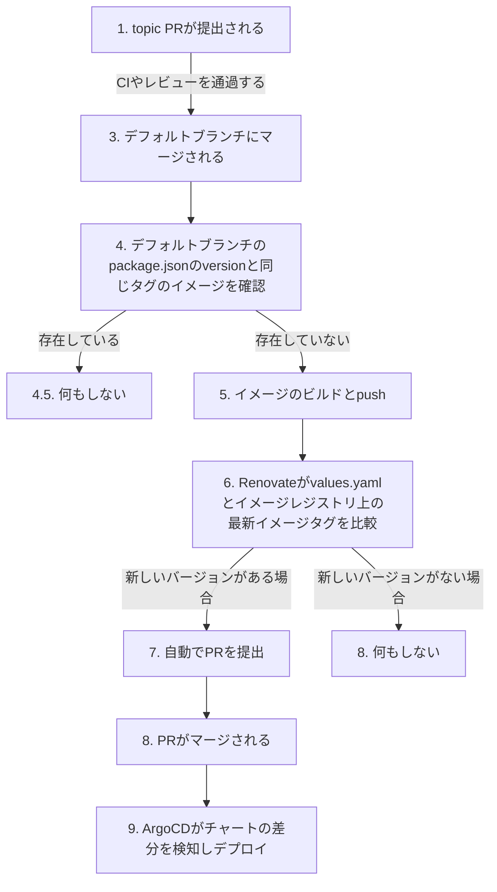

```mermaid
graph TD
    A[1. topic PRが提出される] -->|CIやレビューを通過する| B[3. デフォルトブランチにマージされる]
    B --> C[4. デフォルトブランチのpackage.jsonのversionと同じタグのイメージを確認]
    C -->|存在している| D[4.5. 何もしない]
    C -->|存在していない| E[5. イメージのビルドとpush]
    E --> F[6. Renovateがvalues.yamlとイメージレジストリ上の最新イメージタグを比較]
    F -->|新しいバージョンがある場合| G[7. 自動でPRを提出]
		F -->|新しいバージョンがない場合| H[8. 何もしない]
    G --> I[8. PRがマージされる]
    I --> J[9. ArgoCDがチャートの差分を検知しデプロイ]

```
